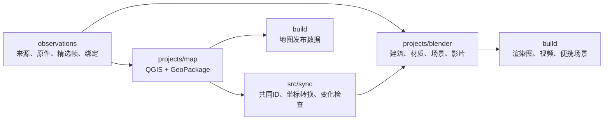

# 架构与不变量

原生工程保存长期作者成果，代码操作工程，生成结果进入 build。现实校园的观测持续支持二维地图与三维校园的更新。

## 各层维护什么

`observations/catalog.json` 维护来源身份、取得时间、许可、原件路径与散列。`observations/bindings/assets.json` 关联建筑、部件和楼层。拍摄时间、网页发布日期与下载时间分别记录；未知值保持未知。失败下载不能计为已取得的原件。

精选视频帧、筛选原因、标注与配准控制点是正式来源工作。连续帧是相关观测，不能凭帧数提高独立来源的可信度。模型渲染不是现实观测。

`projects/map/campus.gpkg` 是唯一可编辑的当前校园空间源。样式与布局属于 QGIS 项目；导出的 JSON/GeoJSON 属于 build。不能同时维护另一份 canonical JSON、覆盖清单或脚本中的建筑高度。

`projects/blender/` 保存三维作者成果。单栋资产、校园装配、材质、景观、相机、动画和影片均在这里维护。程序生成后经过精修的模型同样是正式源稿。

`src/` 按操作对象划分。必要配置跟随原生工程；检查报告不充当生成器的领域输入。`build/` 保存派生地图、检查、候选帧、渲染、成片和便携场景。README.assets 中少量精选展示图是文档资源。

## 三个不变量

1. **身份一致。** 保留稳定 asset_id。改名不改 ID；外部来源 ID 是关联字段。与 njupt-search 的空间身份显式关联，不建立重叠建筑身份。
2. **坐标一致。** 地图 EPSG:32650，Blender 局部米制。X 向网格东、Y 向网格北、Z 向上。原点由数据库元数据维护。Z=0 为局部地面基准，不表示海拔零米。
3. **归属唯一。** 地图维护共同位置、基底与空间参数；Blender 维护细部网格、材质、灯光和动画。共同参数不能被后续脚本隐式覆盖。

占地、楼层和屋顶可以有不同几何：以共同 ID 关联，同时标明几何角色，不要求轮廓重合。

## 更新与历史

单纯平移可以更新实例；轮廓变化先报告并调整模型，不直接覆盖精修网格。校园场景中的人工构图、景观、相机与动画同样需要保护。

替换旧实现后删除并迁移调用。Git/LFS 保留历史，活动目录不保存兼容壳、旧版本或时间戳备份。仍有用途的现实观测原件继续保存，不属于软件兼容留存。

公共原件由来源许可决定。未明确许可的原图与受限疏散图留在本地；公共工程只有可选外部参考，没有内嵌原件。
